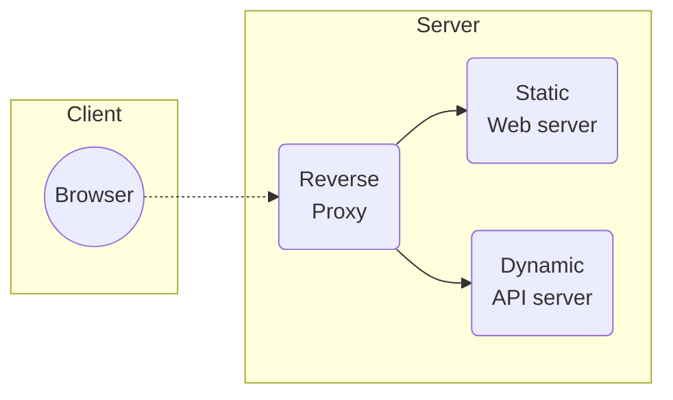
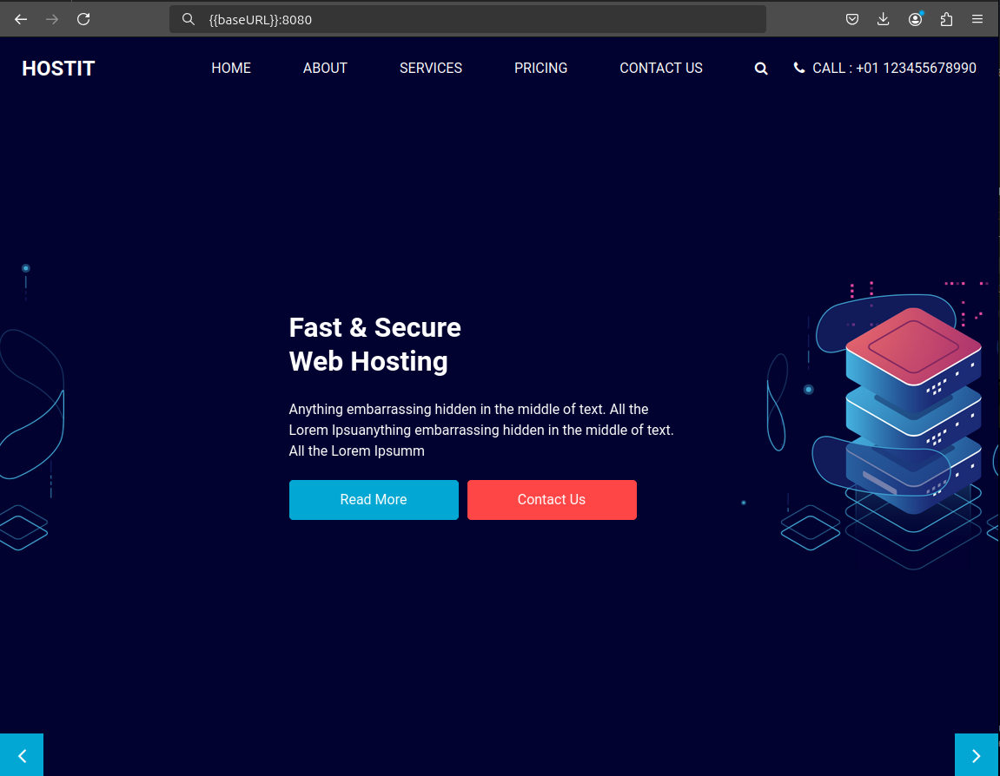
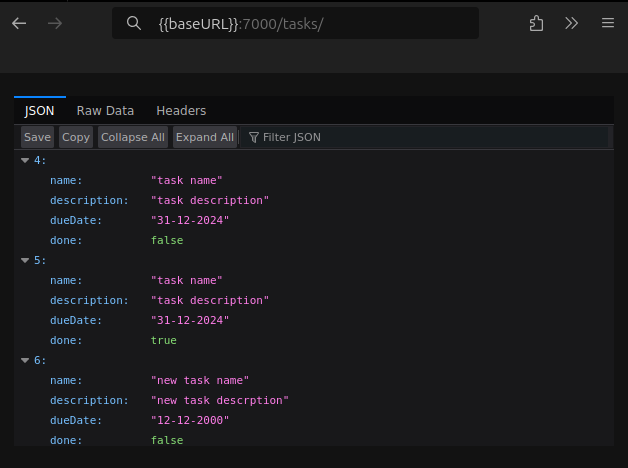
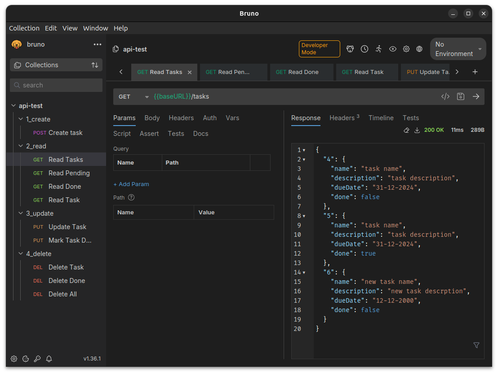
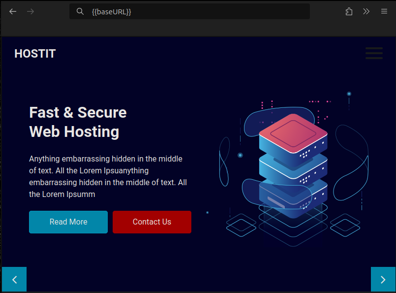
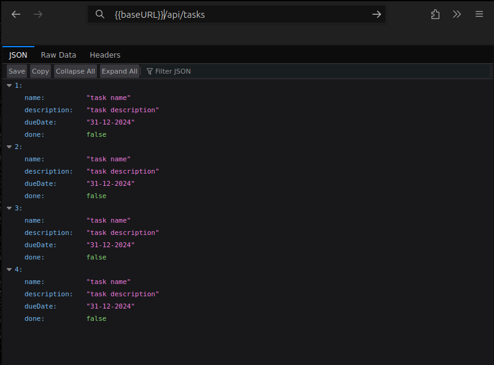
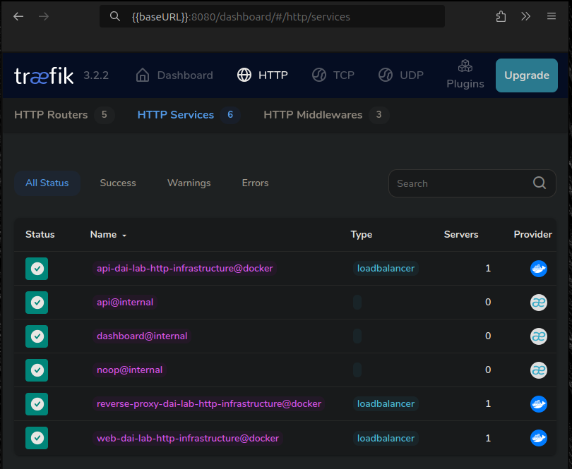
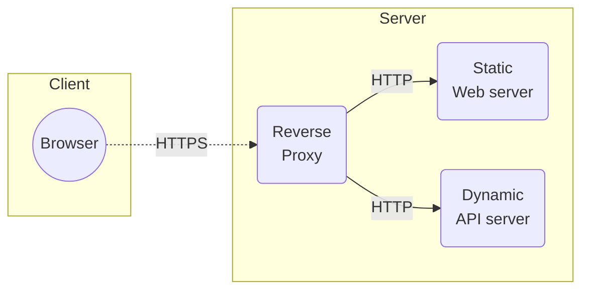

DAI Lab - HTTP infrastructure
=============================

Objectives
----------

The main objective of this lab is to learn to build a complete Web infrastructure. This means, we will build a server infrastructure that serves a static Web site and a dynamic HTTP API. The diagram below shows the architecture of the infrastructure that we will build.



In addition to the basic requirement of service static and dynamic content, the infrastructure will have the following features:

- **Scalability**: both the static and the dynamic server will be deployed as a cluster of several instances. The reverse proxy will be configured to distribute the load among the instances.
- **Security**: the connection between the browser and the reverse proxy will be encrypted using HTTPS.
- **Management**: a Web application will be deployed to manage the infrastructure. This application will allow to start/stop instances of the servers and to monitor the state of the infrastructure.

General instructions
--------------------

- This is a **BIG** lab and you will need a lot of time to complete it. 
- You will work in **groups of 2 students** and use a Git workflow to collaborate.
- For certain steps you will need to do research in the documentation by yourself (we are here to help, but we will not give you step-by-step instructions!) or you will need to be creative (do not expect complete guidelines).
- Read carefully all the **acceptance criteria** of each step. They will tell you what you need to do to complete the step.
- After the lab, each group will perform a short **demo** of their infrastructure.
- **You have to write a report with a short descriptioin for each of the steps.** Please do that directly in the repo, in one or more markdown files. Start in the README.md file at the root of your directory.
- The report must contain the procedure that you have followed to prove that your configuration is correct (what you did do make the step work and what you would do if you were doing a demo).


Step 0: GitHub repository
-------------------------

Create a GitHub repository for your project. You will use this repository to collaborate with your team mate. You will also use it to submit your work. 

> [!IMPORTANT]
> Be careful to keep a clear structure of the repository such that the different components are clearly separated.

### Acceptance criteria

- [X] You have created a GitHub repository for your project.
- [X] The respository contains a Readme file that you will use to document your project.


Step 1: Static Web site
-----------------------

The goal of this step is to build a Docker image that contains a static HTTP server Nginx. The server will serve a static Web site. The static Web site will be a single page with a nice looking template. You can use a free template for example from [Free-CSS](https://www.free-css.com/free-css-templates) or [Start Bootstrap](https://startbootstrap.com/themes).

### Acceptance criteria

- [X] You have created a separate folder in your respository for your static Web server.
- [X] You have a Dockerfile based on the Nginx image. The Dockerfile copies the static site content into the image.
- [X] You have configured the `nginx.conf` configuration file to serve the static content on a port (normally 80).
- [X] You are able to explain the content of the `nginx.conf` file.
- [X] You can run the image and access the static content from a browser.
- [X] You have **documented** your configuration in your report.

### Report



#### Files description
A folder name `nginx` has been created for the static Web server. Inside it are the following files:
- **html/**: contains the source of the website. The template source can be found [here](https://www.free-css.com/free-css-templates/page293/hostit).
- **nginx.conf**: contains the configuration for the nginx server. It defines the port on which to listen, the root for the source of the website and the index file.
- **Dockerfile**: define the specifications for the docker image. In the current case, it gets the latest nginx image, copies the nginx.conf file to the image as well as the source files for the website.

#### Dockerfile:

```docker
# Getting image
FROM nginx:latest

# Copying nginx conf to image
COPY nginx.conf /etc/nginx/conf.d/default.conf

# Copying website source to image
COPY html /usr/share/nginx/html
```

#### nginx.conf
```
# Setting up the server
server {
    # Defining port
    listen 80;

    # Source of the website
    root /usr/share/nginx;

    # Index file source
    index index.html;
}
```


Step 2: Docker compose
----------------------

The goal of this step is to use Docker compose to deploy a first version of the infrastructure with a single service: the static Web server.

In addition to the basic docker compose configuration, we want to be able to rebuild the docker image of the Web server. See the [Docker compose Build documentation](https://docs.docker.com/compose/compose-file/build/) for this part.

### Acceptance criteria

- [X] You have added a docker compose configuration file to your GitHub repo.
- [X] You can start and stop an infrastructure with a single static Web server using docker compose.
- [X] You can access the Web server on your local machine on the respective port.
- [X] You can rebuild the docker image with `docker compose build`
- [X] You have **documented** your configuration in your report.

### Report

A docker compose file has been added to the root of the folder (`docker-compose.yml`).

Its contents is as follows:
```docker
services:
  # Web Service
  web:
    image: nginx
    # Port mapping
    ports:
      - "8080:80"
    # Volumes
    volumes:
      - ./nginx/html:/usr/share/nginx/html
      - ./nginx/nginx.conf:/etc/nginx/conf.d/default.conf
```

This file allows us to define the infrastructure to deploy in a single file. Currently, a single service named web has been added. The image to use is nginx, it maps the port 8080 to the port 80 and two volumes are set up for the configuration of the service and the source to use for the website.


Step 3: HTTP API server
-----------------------

This step requires a more work. The goal is to build a HTTP API with Javalin. You can implement any API of your choice, such as:

- an API to manage a list of quotes of the day
- an API to manage a list of TODO items
- an API to manage a list of people

Use your imagination and be creative!

The only requirement is that the API supports at all CRUD operations, i.e.: Create, Read, Update, Delete. 

Use a API testing tool such as Insomnia, Hoppscotch or Bruno to test all these operations.

The server does not need to use a database. You can store the data in memory. But if you want to add a DB, feel free to do so.

Once you're finished with the implementation, create a Dockerfile for the API server. Then add it as a service to your docker compose configuration.

### Acceptance criteria

- [X] Your API supports all CRUD operations.
- [X] You are able to explain your implementation and walk us through the code.
- [X] You can start and stop the API server using docker compose.
- [X] You can access both the API and the static server from your browser.
- [X] You can rebuild the docker image with docker compose.
- [X] You can do demo where use an API testing tool to show that all CRUD operations work.
- [X] You have **documented** your implementation in your report.

### Report
#### API

The created API is used to manage a list of TODO items and suports all CRUD operation, as described hereafter.
The deployment the application can be made with docker by using the `docker-compose.yml` file. When using the command `docker compose build` the application is built with maven and run inside a container. The same file also deploy de static website. The API can be accessed on the port `7000` and the website one the port `8080`.

The API can also be accessed from a browser as seen here:



Every command has been tested with Bruno. The collection can be found in the folder `api-test`.



#### Create
##### **Create a Task**

| **API Command**         | `/tasks`                      |
|--------------------------|-------------------------------|
| **Type of Command**      | `POST`                       |
| **Input**                | JSON object of a `Task`. Example: `{"name": "{{name}}", "description": "{{description}}", "dueDate": "{{dueDate}}"}` |
| **Output**               | JSON object of the created task. |
| **Status Codes**         | `201 Created` on success. |

---

#### Read
##### **Get All Tasks**

| **API Command**         | `/tasks`                     |
|--------------------------|------------------------------|
| **Type of Command**      | `GET`                        |
| **Input**                | None                         |
| **Output**               | JSON object containing all tasks. |
| **Status Codes**         | `200 OK` on success.         |

##### **Get Pending Tasks**

| **API Command**         | `/tasks/pending`             |
|--------------------------|------------------------------|
| **Type of Command**      | `GET`                        |
| **Input**                | None                         |
| **Output**               | JSON object containing tasks with `done: false`. |
| **Status Codes**         | `200 OK` on success.         |


##### **Get Completed Tasks**

| **API Command**         | `/tasks/done`                |
|--------------------------|------------------------------|
| **Type of Command**      | `GET`                        |
| **Input**                | None                         |
| **Output**               | JSON object containing tasks with `done: true`. |
| **Status Codes**         | `200 OK` on success.         |


##### **Get a Specific Task**

| **API Command**         | `/tasks/{id}`                |
|--------------------------|------------------------------|
| **Type of Command**      | `GET`                        |
| **Input**                | Path parameter: `id` (integer). Example: `/tasks/1` |
| **Output**               | JSON object of the task with the given `id`. |
| **Status Codes**         | `200 OK` if task exists. <br>`404 Not Found` if task does not exist. |

---

#### Update
##### **Update a Task**

| **API Command**         | `/tasks/{id}`                |
|--------------------------|------------------------------|
| **Type of Command**      | `PUT`                        |
| **Input**                | Path parameter: `id` (integer). <br>JSON object of updated task. Example: `{ "title": "Updated Task", "done": false }` |
| **Output**               | None                         |
| **Status Codes**         | `204 No Content` on success. |


##### **Mark a Task as Done**

| **API Command**         | `/tasks/{id}/done`           |
|--------------------------|------------------------------|
| **Type of Command**      | `PUT`                        |
| **Input**                | Path parameter: `id` (integer). Example: `/tasks/1` |
| **Output**               | None                         |
| **Status Codes**         | `204 No Content` on success. <br>`404 Not Found` if task does not exist. |

---

#### Delete
##### **Delete a Specific Task**

| **API Command**         | `/tasks/{id}`                |
|--------------------------|------------------------------|
| **Type of Command**      | `DELETE`                     |
| **Input**                | Path parameter: `id` (integer). Example: `/tasks/1` |
| **Output**               | None                         |
| **Status Codes**         | `204 No Content` on success. |


##### **Delete All Completed Tasks**

| **API Command**         | `/tasks/done`                |
|--------------------------|------------------------------|
| **Type of Command**      | `DELETE`                     |
| **Input**                | None                         |
| **Output**               | None                         |
| **Status Codes**         | `204 No Content` on success. |


##### **Delete All Tasks**

| **API Command**         | `/tasks`                     |
|--------------------------|------------------------------|
| **Type of Command**      | `DELETE`                     |
| **Input**                | None                         |
| **Output**               | None                         |
| **Status Codes**         | `204 No Content` on success. |


Step 4: Reverse proxy with _Traefik_
----------------------------------

The goal of this step is to place a reverse proxy in front of the dynamic and static Web servers such that the reverse proxy receives all connections and relays them to the respective Web server. 

You will use [_Traefik_](https://_Traefik_.io/_Traefik_/) as a reverse proxy. _Traefik_ interfaces directly with Docker to obtain the list of active backend servers. This means that it can dynamically adjust to the number of running server. _Traefik_ has the particularity that it can be configured using labels in the docker compose file. This means that you do not need to write a configuration file for _Traefik_, but _Traefik_ will read container configurations from the docker engine through the file `/var/run/docker.sock`.

The steps to follow for this section are thus:

- Add a new service "reverse_proxy" to your docker compose file using the _Traefik_ docker image
- Read the [_Traefik_ Quick Start](https://doc._Traefik_.io/_Traefik_/getting-started/quick-start/) documentation to establish the basic configuration.
- Read the [_Traefik_ & Docker](https://doc._Traefik_.io/_Traefik_/routing/providers/docker/) documentation to learn how to configure _Traefik_ to work with Docker.
- Then implement the reverse proxy:
  - relay the requests coming to "localhost" to the static HTTP server
  - relay the requests coming to "localhost/api" to the API server. See the [_Traefik_ router documentation](https://doc._Traefik_.io/_Traefik_/routing/routers/) for managing routes based on path prefixes. 
  - you will have to remove the `ports` configuration from the static and dynamic server in the docker compose file and replace them with `expose` configuration. _Traefik_ will then be able to access the servers through the internal Docker network.
- You can use the [_Traefik_ dashboard](https://doc._Traefik_.io/_Traefik_/operations/dashboard/) to monitor the state of the reverse proxy.

### Acceptance criteria

- [X] You can do a demo where you start from an "empty" Docker environment (no container running) and using docker compose you can start your infrastructure with 3 containers: static server, dynamic server and reverse proxy
- [X] In the demo you can access each server from the browser in the demo. You can prove that the routing is done correctly through the reverse proxy.
- [X] You are able to explain how you have implemented the solution and walk us through the configuration and the code.
- [X] You are able to explain why a reverse proxy is useful to improve the security of the infrastructure.
- [X] You are able to explain how to access the dashboard of _Traefik_ and how it works.
- [X] You have **documented** your configuration in your report.

### Report
#### Overview
_Traefik_ has been configured to route traffic to different servers based on path prefixes:

- `{baseURL}` redirects to the **static website**.
- `{baseURL}/api/` redirects to the **dynamic server (API)**.
- The **Traefik dashboard** can be accessed using the URL: `{baseURL}:8080`.

On the **Traefik dashboard**, we can see the different services detected by the reverse proxy. The use of a reverse proxy increases **security**, **resiliency**, and **adaptability**. By using a reverse proxy, we can limit the information about the servers exposed to the user. A reverse proxy offers a single point of contact for the user, which minimizes the attack surface.

Additionally, since the user always interacts with the reverse proxy, we can improve the resiliency of the infrastructure by deploying multiple instances of the same service to enable **load balancing** and **failover** without requiring any changes on the user side. Furthermore, the reverse proxy allows us to completely replace or update services behind it **seamlessly**, without causing any interruption for users.

#### Routing and Results
- **Page accessed at `{baseURL}`** (static website):<br><br>
    <br><br>

- **Page accessed at `{baseURL}/api/tasks`** (dynamic API):<br><br>
    <br><br>

- **Traefik dashboard accessed at `{baseURL}:8080`**:<br><br>
    

#### Configuration:

The following lines have been added to the file `docker-compose.yml` to deploy _Traefik_:
```docker
  reverse_proxy:
    image: traefik:latest
    # Needed to deploy the dashboard
    command: --api.insecure=true --providers.docker
    ports:
      - 80:80
      - 8080:8080
    # Allows Traefik to auto-detect new service by monitoring the docker.sock file
    volumes:
      - /var/run/docker.sock:/var/run/docker.sock
    # Enables Traefik
    labels:
      - "traefik.enable=true"
```

We were then able to define routing rules by using labels in definition of the different services as seen hereafter:
1. Static website:
```docker
    labels:
      - "traefik.http.routers.web.rule=Host(`{baseURL}`)"
```
2. Dynamic website:
```docker
    labels:
      # Defining the path prefix
      - "traefik.http.routers.api.rule=Host(`{baseURL}`) && PathPrefix(`/api`)"
      # Setting up rule to strip the path prefix before redirecting to server
      - "traefik.http.routers.api.middlewares=strip-api-prefix"
      - "traefik.http.middlewares.strip-api-prefix.stripprefix.prefixes=/api"
```

Step 5: Scalability and load balancing
--------------------------------------

The goal of this section is to allow _Traefik_ to dynamically detect several instances of the (dynamic/static) Web servers. You may have already done this in the previous step 3.

Modify your docker compose file such that several instances of each server are started. Check that the reverse proxy distributes the connections between the different instances. Then, find a way to *dynamically* update the number of instances of each service with docker compose, without having to stop and restart the topology.

### Acceptance criteria

- [ ] You can use docker compose to start the infrastructure with several instances of each server (static and dynamic).
- [ ] You can dynamically add and remove instances of each server.
- [ ] You can do a demo to show that _Traefik_ performs load balancing among the instances.
- [ ] If you add or remove instances, you can show that the load balancer is dynamically updated to use the available instances.
- [ ] You have **documented** your configuration in your report.


Step 6: Load balancing with round-robin and sticky sessions
-----------------------------------------------------------

By default, _Traefik_ uses round-robin to distribute the load among all available instances. However, if a service is stateful, it would be better to send requests of the same session always to the same instance. This is called sticky sessions.

The goal of this step is to change the configuration such that:

- _Traefik_ uses sticky session for the dynamic server instances (API service).
- _Traefik_ continues to use round robin for the static servers (no change required).

### Acceptance criteria

- [ ] You do a setup to demonstrate the notion of sticky session.
- [ ] You prove that your load balancer can distribute HTTP requests in a round-robin fashion to the static server nodes (because there is no state).
- [ ] You prove that your load balancer can handle sticky sessions when forwarding HTTP requests to the dynamic server nodes.
- [ ] You have **documented** your configuration and your validation procedure in your report.


Step 7: Securing _Traefik_ with HTTPS
-----------------------------------

Any real-world web infrastructure must be secured with HTTPS instead of clear-text HTTP. The goal of this step is to configure _Traefik_ to use HTTPS with the clients. The schema below shows the architecture.



This means that HTTPS is used for connection with clients, over the Internet. Inside the infrastructure, the connections between the reverse proxy and the servers are still done in clear-text HTTP.

### Certificate

To do this, you will first need to generate an encryption certificate. Since the system is not exposed to the Internet, you cannot use a public certificate such as Let's encrypt, but have to generate a self-signed certificate. You can [do this using openssl](https://stackoverflow.com/questions/10175812/how-to-create-a-self-signed-certificate-with-openssl#10176685).

Once you got the two files (certificate and key), you can place them into a folder, which has to be [mounted as a volume in the _Traefik_ container](https://docs.docker.com/compose/compose-file/compose-file-v3/#short-syntax-3). You can mount the volume at any path in the container, for example `/etc/_Traefik_/certificates`.

### _Traefik_ configuration file

Up to now, you've configured _Traefik_ through labels directely in the docker compose file. However, it is not possible to specify the location of the certificates to _Traefik_ with labels. You have to create a configuration file `_Traefik_.yaml`. 

Again, you have to mount this file into the _Traefik_ container as a volume, at the location `/etc/_Traefik_/_Traefik_.yaml`.

The configuration file has to contain several sections:

- The [providers](https://doc._Traefik_.io/_Traefik_/providers/docker/#configuration-examples) section to configure _Traefik_ to read the configuration from Docker.
- The [entrypoints](https://doc._Traefik_.io/_Traefik_/routing/entrypoints/#configuration-examples) section to configure two endpoints:  `http` and `https`.
- The [tls](https://doc._Traefik_.io/_Traefik_/https/tls/#user-defined) section to configure the TLS certificates. Specify the location of the certificates as the location where you mounted the directory into the container (such as `/etc/_Traefik_/certificates`).
- In order to make the dashboard accessible, you have to configure the [api](https://doc._Traefik_.io/_Traefik_/operations/dashboard/#insecure-mode) section. You can remove the respective labels from the docker compose file.

### Activating the HTTPS entrypoint for the servers

Finally, you have to activate HTTPS for the static and dynamic servers. This is done in the docker compose file. You have to add two labels to each server:

- to activate the HTTPS entrypoint,
- to set TLS to true.

See the [_Traefik_ documentation for Docker](https://doc._Traefik_.io/_Traefik_/routing/providers/docker/#routers) for these two labels.

### Testing

After these configurations it should be possible to access the static and the dynamic servers through HTTPS. The browser will complain that the sites are not secure, since the certificate is self-signed. But you can ignore this warning.

If it does not work, go to the _Traefik_ dashboard and check the configuration of the routers and the entrypoints.

### Acceptance criteria

- [ ] You can do a demo where you show that the static and dynamic servers are accessible through HTTPS.
- [ ] You have **documented** your configuration in your report.


Optional steps
==============

If you sucessfully complete all the steps above, you can reach a grade of 5.0. If you want to reach a higher grade, you can do one or more of the following optional steps. 

Optional step 1: Management UI
------------------------------

The goal of this step is to deploy or develop a Web app that can be used to monitor and update your Web infrastructure dynamically. You should be able to list running containers, start/stop them and add/remove instances.

- you use an existing solution (search on Google)
- for extra points, develop your own Web app. In this case, you can use the Dockerode npm module (or another Docker client library, in any of the supported languages) to access the docker API.

### Acceptance criteria

- [ ] You can do a demo to show the Management UI and manage the containers of your infrastructure.
- [ ] You have **documented** how to use your solution.
- [ ] You have **documented** your configuration in your report.


Optional step 2: Integration API - static Web site
--------------------------------------------------

This is a step into unknow territory. But you will figure it out.

The goal of this step is to change your static Web page to periodically make calls to your API server and show the results in the Web page. You will need JavaScript for this and this functionality is called AJAX.

Keep it simple! You can start by just making a GET request to the API server and display the result on the page. If you want, you can then you can add more features, but this is not obligatory.


The modern way to make such requests is to use the [JavaScript Fetch API](https://developer.mozilla.org/en-US/docs/Web/API/Fetch_API/Using_Fetch). But you can also use JQuery if you prefer.


### Acceptance criteria

- [ ] You have added JavaScript code to your static Web page to make at least a GET request to the API server.
- [ ] You can do a demo where you show that the API is called and the result is displayed on the page.
- [ ] You have **documented** your implementation in your report.

